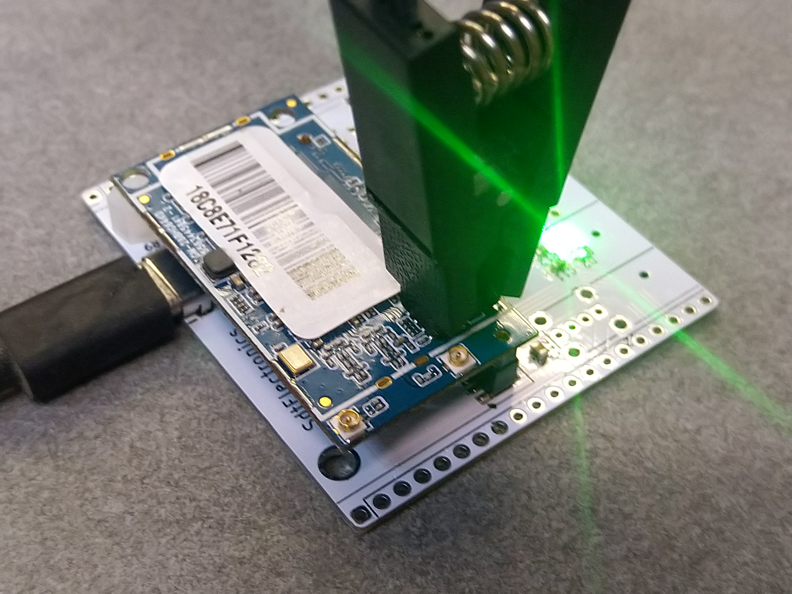

# Guide on Firmware
## Factory Partition Backup (IMPORTANT)
The wireless calibration file (aka ART file) resides in the factory partition of original firmware. If you proceed with altering the original firmware without backing up this partition, you are at the risk of permanent lost of the calibration data. Therefore, be sure you have backed up this partition before flashing your device!


Connect to the type-C port and your PC should be able to probe the onboard USB-Serial interface. Windows users may need to install CH340 driver manually. The configuration of serial is 57600bps, 8bits, no even, 1 stop bit. Open a serial terminal on your PC and run following command:

```
cat /dev/mtd2 > /tmp/art.bin
```

Then connect to one of RJ45 Ports, and run following command:

```
ifconfig eth2 192.168.100.1
tcpsvd -vE 0.0.0.0 21 ftpd /tmp
```

Set the IP of the interface on your PC which connected to the board to `192.168.100.2`, and your PC are ready to establish network connection with the board. You can run `ping` to verify the link, or proceed to access `ftp://192.168.100.1` with a file explorer. You should find a file named `art.bin` there and copy it to the storage of your PC.

## Flashing New Firmware
The original firmware runs a archaic linux 2.6 kernel and provides quite limited functionality, thus it is preferred to flash a new system. The original u-boot is capable to do this therefore it's unnecessary to upgrade it. Candidates of OpenWRT firmware should be compatible with `ramips MT7620` SoC and come with names like `xxx-squashfs-sysupgrade.bin`. A pitfall is the core board only breaks out the `UART1` which is connected to the onboard USB-Serial interface, while most of the pre-configured firmwares use `UART0` as the console. Flashing randomly picked firmware will thereby essentially brick your device.


Connect to the type-C port and your PC should be able to probe the onboard USB-Serial interface. Open a serial terminal on your PC and run `reboot` to enter the bootloader. Press `2` right after the board is restarted and you will see instructions leading you to upgrade the system. Then connect to one of the RJ45 Ports and set the IP of the interface on your PC which connected to the board to `192.168.1.10`. Run a tftp server on your PC and move the firmware to the root path of the server. Rename the firmware to `fw.bin`. Head back to the terminal and leave the default configurations unchanged and proceed with `Enter`. Now a progress bar should appear on the terminal. Wait until it is finished and it will reboot to the new system.

## Setup opkg
If you opt into an OpenWRT firmware, the package manager is the most convenient way to get new softwares. But it requires some configuration before using:


Switch the source mirror:
```
sed -i 's_downloads.openwrt.org_mirrors.tuna.tsinghua.edu.cn/openwrt_' /etc/opkg/distfeeds.conf
```

Update the source:

```
opkg update
```

## Flash Operation with SPI Programmer
In some cases you may want to directly access the onboard flash. Without removing it from board, clamp it with a programmer will cause troubles as the SoC is powered up and confuses the programmer. One walk-around is to use `poweroff` command to shutdown the SoC in advance. If the device is already bricked and that is no longer feasible, use a soldering iron to make the `VCC` or `GND` pin of the flash float works as well.

